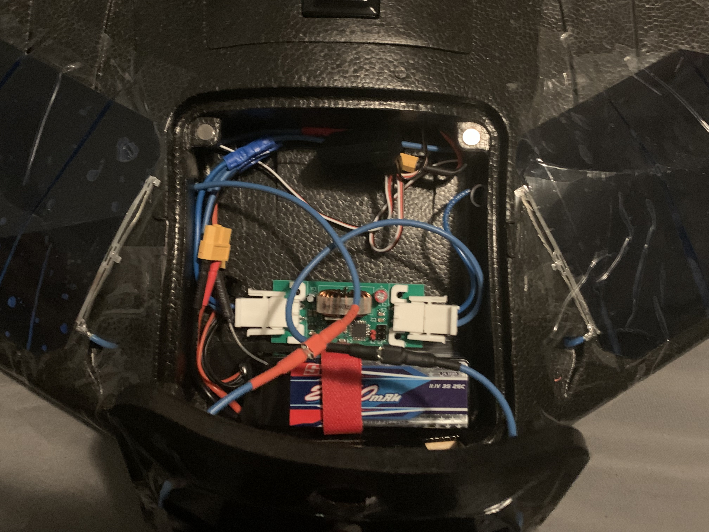

# Fixed-Wing Solar-Powered Drone

  

For my Capstone Final Project in Electrical Engineering at The University of Western Ontario, my team and I decided to make a solar-powered fixed-wing drone. 

This involved making a solar array and designing a Maximum Power Point Tracker (MPPT) to charge the drone's Li-Po battery from the solar array.

My contribution to the project was writing the software for the MPPT. This repo is the firmware of the MPPT.

  

MPPT Version 2

  

MPPT Installed in Drone

The MPPT is a boost converter with an embedded microcontroller which performs a Perturb and Observe algorithm.

This device facilitates the optimal charging of the Li-Po battery of the drone from the solar array.

## Software Design

I really wanted to learn some professional embedded design skills for this project so I decided to do everything a little harder than it had to be.

I wrote all the code in C from a Linux command line, purposely avoiding Arduino based software. This gave me the opportunity to learn Make, Git, interacting with USB ports in Linux, UART, AVR build tools, and so many other cool things.

I programmed all the code for this device in the best code editor around, VIM.

The microcontroller I used was the ATmega328P. 

  

ATmega328P Installed on MPPT

This is also the microcontroller that is used on the Arduino. I decided to use this microcontroller because I could write C on the ATmega on an Arduino I already had (avoiding all Arduino software). This allowed me to progress the software design before the hardware design was complete.

### Software Structure

The program running on the MPPT has 3 inputs and 1 output (more if you include UART for debugging).
The inputs are input voltage (from the solar array), input current (from the solar array), and the battery voltage. These values are processed and passed to the MPPT algorithm to determine the duty cycle of the output PWM signal. This PWM signal goes to the MOSFET of the boost converter to control the voltage applied to the battery.

To ensure periodic operation of these tasks, an interrupt occurs regularly to trigger the beginning of these tasks.

  

Control Flow Diagram

All of these individual components can be found in aptly named files in the src folder with their associated headers in the include folder.

  

File Structure

### Build system

I used make as a build system for this project. I used AVR build tools to compile and flash the programs. avr-gcc and avr-objcopy are used to compile and format the .c files and avrdude is the tool used to flash the components.

There are several targets in the Makefile for a few setups. Some of them are used for flashing prototype code to an Arduino and some are used for preparing an Arduino to be a programmer for the MPPT.

Below is the setup for programming the MPPT device over ICSP.

  

ICSP Programming Setup

For debugging purposes we had 2 pins for UART communication.

  

UART to USB Debugging Setup

I was able to view the information sent out of the ATmega through UART by using a UART to USB converter. I could then use a tool to view the serial input on my laptop. I mainly used **screen**, a command line tool, to view the stream but I also wrote a Python program which monitored, logged, and plotted the data from this stream in real-time. Check it out at https://github.com/anakin4747/MPPT-Display

## Acknowledgments
I just want to thank my team, Mustafa Abdalle, Alex Kirchberger, and Parker Young, who handled the circuit design, component sourcing, and project management. This project couldn't have been possible without them.

I also want to thank the following YouTube channels:

Low Level Learning - https://www.youtube.com/c/lowlevellearning

Mitch Davis - https://www.youtube.com/@MitchDavis2
